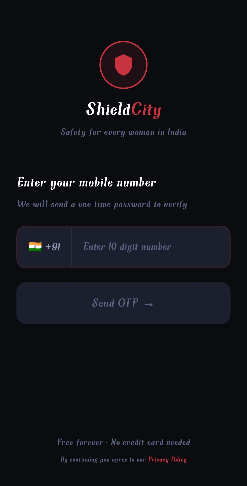
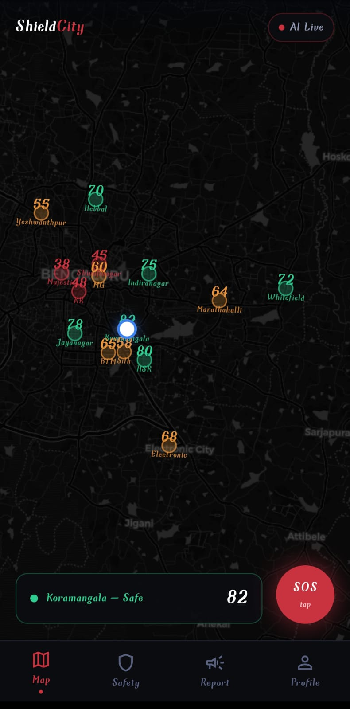
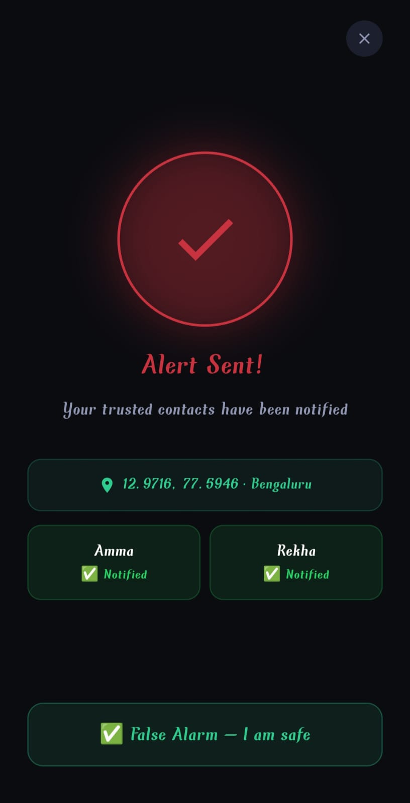
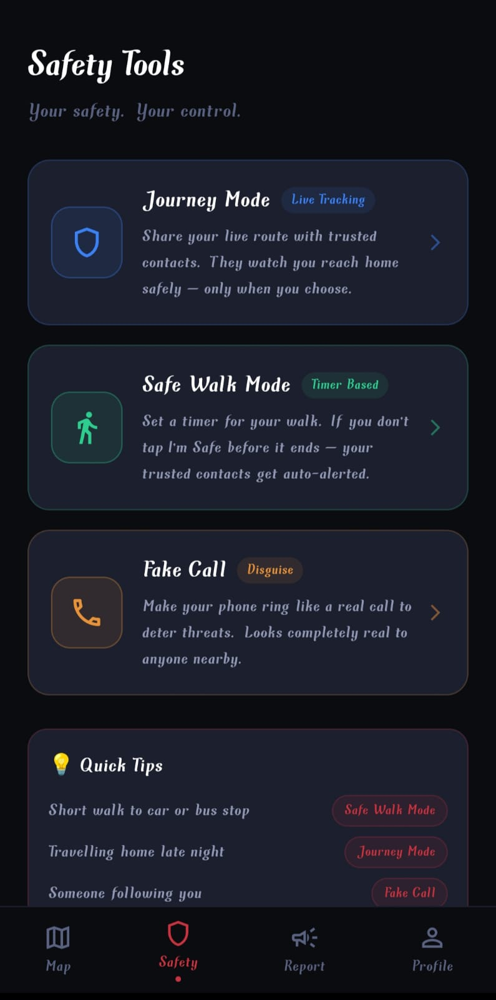
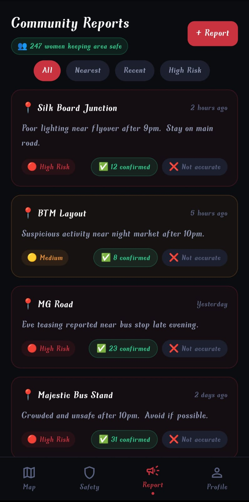
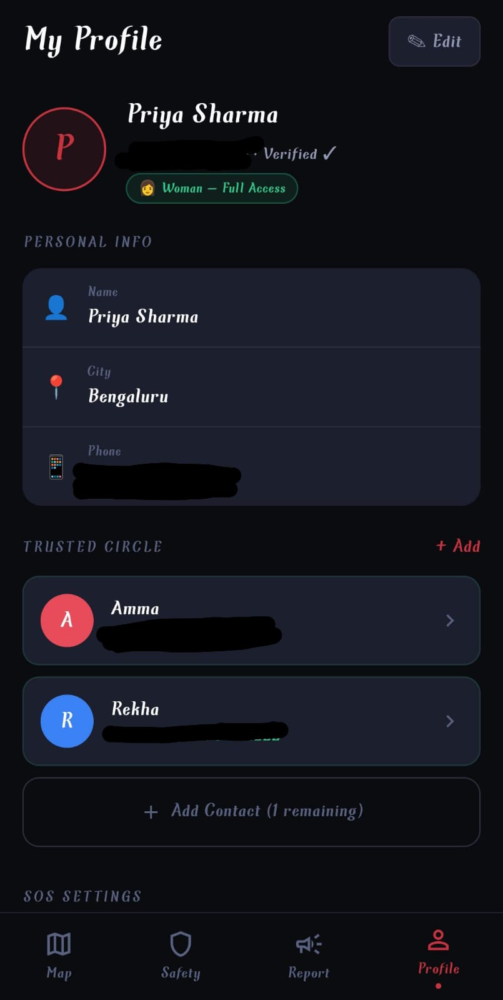

# 🚨 Shield City App

## 📌 Overview
Shield City is a mobile safety application for women built using Flutter.  
It helps users stay safe by providing emergency features like SOS alerts, authentication, and safety tools.

---

## 🚧 Project Status
⚠️ Backend integration is currently in progress.

---

## ✨ Features
- 🔐 User Authentication (Login & OTP)
- 🏠 Home Dashboard(safety scores with map)
- 🚨 SOS Emergency Feature
- 📊 Safety Tools & Reports
- 👤 User Profile Management

---

## 🛠 Tech Stack
- Flutter
- Dart
- Firebase (planned)

---

## 📸 Screenshots


### 🔐 Login Screen


### 🏠 Home Page


### 🚨 SOS Feature


### 🛠 Safety Tools


### 📊 Report Screen


### 👤 Profile Screen


---

## 🚀 How to Run

```bash
flutter pub get
flutter run
